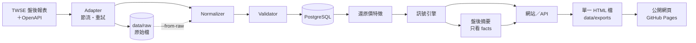

# AI 台股市場雷達（Taiwan Stock Intelligence Radar）

台股盤後資料平台：官方公開資料 → 資料庫 → 還原價與特徵 → 異常訊號 → 網站 → AI 解讀。
只描述市場發生了什麼，不提供任何買賣建議。

## 目前進度

| 步驟 | 內容 | 狀態 |
| --- | --- | --- |
| 1 | PostgreSQL、migration、seed（Docker 或 Windows 本機） | 完成 |
| 2 | TWSE 行情、指數、漲跌家數、三大法人 | 完成；2026-09-25 用真實資料驗證並入庫 |
| 3 | 回補 1 年歷史（可中斷續跑、先下載再入庫） | 完成；243 個交易日、19 個休市日，零失敗 |
| 4 | 除權息／產業別／休市日曆爬蟲、還原價特徵、訊號引擎 v2、一致性稽核 | 完成；見 `docs/crawler-tasks.md`、`docs/signals.md` |
| 5–7 | JSON API、首頁、股票頁、搜尋、資料與計算方式 | 完成；`python -m radar web`。新手／標準／進階模式、今日 3 大重點、異常摘要、「為什麼被雷達抓到」、研究路徑、條件搜尋，見 `docs/architecture.md` |
| 8 | 盤後摘要 | 完成；有 Claude API 金鑰用 AI，沒有就用模擬摘要（依規則組句，網站標示「模擬」） |
| 9 | 發布 | 本機每日排程已註冊；分享用單一 HTML 檔（`export`）；公開網頁每天自動發布到 GitHub Pages（只放盤後快照）。公開上線前需先確認證交所資訊使用規範 |
| 10 | 多頁式、響應式、App 模式 | 完成；入口頁（影片背景）＋今日市場／今日雷達／訊號回測／搜尋／個股／說明各一頁（網站與 HTML 檔相同），桌面與手機同一份功能，可安裝（PWA）。見下方「App 模式」 |
| 12 | 上櫃股票 | 進行中；櫃買中心 OpenAPI 每天抓最新一天（行情、三大法人、除權息、櫃買指數、漲跌家數、公司產業別），搜尋、個股頁、今日市場、盤中即時都包含上櫃。OpenAPI 沒有歷史，上櫃的訊號要累積 20～60 個交易日才會陸續出現 |
| 11 | 訊號回測（Phase 3） | 完成；每筆訊號之後 5／20／60 日的還原報酬，和同一天全部股票比較；新手／標準／進階三種深度，進階有「市面說法 vs 資料」與限制說明。見 `docs/signals.md` |

範圍：上市（TWSE）＋上櫃（TPEX，2026-10-02 起每天收集）。測試 113 項（`pytest -q`）。

**架構調整**：原規劃網站用 Next.js。開發機是 4 GB 記憶體的筆電，Next.js 建置要 1 GB 以上且每次改動都要重建，
所以改成 Python（FastAPI）直接產生 HTML，圖表在伺服器端畫成 SVG，沒有前端建置、開著時約占 85 MB（實測），
並和資料管線共用同一個環境。JSON API 保留，之後要換前端框架可以直接接。

## 資料流程



| 資料集 | 來源 | 頻率 | 寫入 |
| --- | --- | --- | --- |
| MI_INDEX | 全市場日行情、指數、漲跌家數、總成交 | 平日 18:30 起 | `stocks`、`daily_prices`、`market_indices`、`market_breadth`、`trading_calendar` |
| T86 | 三大法人買賣超 | 同上 | `institutional_flows` |
| TWT49U | 除權除息計算結果表（一次一個月） | 每天重抓當月 | `corporate_actions` |
| t187ap03_L＋t187ap14_L | 上市公司基本資料＋產業名稱（OpenAPI） | 每 7 天 | `industries`、`stocks.industry_id` |
| holidaySchedule | 當年度休市日曆（OpenAPI） | 每 7 天 | `trading_calendar`（今天以後） |
| BWIBBU_ALL＋tpex_mainboard_peratio_analysis | 本益比、殖利率、股價淨值比（上市＋上櫃，OpenAPI 最新一天） | 每天 | `valuations` |
| t187ap06_L_*＋mopsfin_t187ap06_O_* | 綜合損益表：EPS、營業收入、稅後淨利（年度累計，OpenAPI 最新一季） | 每天 | `financial_reports` |

所有寫入都是 upsert，重跑不會重複；每次抓取都記錄在 `ingestion_runs`。原始回應都先存檔，改了解析規則可以從檔案重算。

每日流程（`python -m radar daily`）：補抓漏掉的日子 → 更新除權息／公司資料／休市日曆 → 抓當天行情（休市日曆上的日子只確認一次，
其他日子未齊則每 20 分鐘重試到 21:30）→ 計算特徵與訊號 → 盤後摘要（有金鑰用 AI，否則模擬）→ 匯出 HTML 檔 → 發布公開網頁（有設定 `PAGES_REPO` 才做）。任何一步失敗只記錄，不影響其他步驟。

## 快速開始

兩種跑法，程式與資料庫結構完全相同。

### Windows 本機（不用 Docker）

資料庫在背景約占 60 MB；每日流程由工作排程器叫起來跑一次就結束（最高約 75 MB，不開視窗）；網站需要時再開（約 85 MB）。以上都是實測。

1. 安裝 [PostgreSQL](https://www.postgresql.org/download/windows/) 16 以上（開發機用 18；全部預設、埠 5432，結尾不用開 Stack Builder）。
2. 用 postgres 超級使用者跑一次設定（建立帳號與資料庫、低記憶體設定、只接受本機連線）：

   ```powershell
   & "C:\Program Files\PostgreSQL\18\bin\psql.exe" -U postgres -f db\native\setup.sql
   ```

3. 建立 Python 環境與資料表：

   ```powershell
   Copy-Item .env.example .env
   cd services\pipeline
   python -m venv .venv
   .\.venv\Scripts\python -m pip install -r requirements-dev.txt
   .\.venv\Scripts\python -m radar migrate
   ```

4. 回補一年：先下載原始檔（不需要資料庫，約 40 分鐘），再從檔案入庫（約 4 分鐘），接著補除權息與公司資料、計算訊號：

   ```powershell
   .\.venv\Scripts\python -m radar prefetch
   .\.venv\Scripts\python -m radar backfill --from-raw
   .\.venv\Scripts\python -m radar ex-rights
   .\.venv\Scripts\python -m radar companies
   .\.venv\Scripts\python -m radar analyze
   ```

5. 看網站：`.\.venv\Scripts\python -m radar web`，打開 http://127.0.0.1:8000/（API 文件在 `/api/docs`）。
6. 每天自動更新（選用）：

   ```powershell
   powershell -ExecutionPolicy Bypass -File scripts\windows\register-daily-task.ps1
   ```

   觸發條件是平日 18:30 和每次登入（延後 2 分鐘，補上關機、睡眠錯過的日子）。用 `pythonw` 執行、不會跳出視窗，紀錄在 `data\logs\daily.log`。

之後的指令都在 `services\pipeline` 用 `.\.venv\Scripts\python -m radar <指令>` 執行；設定自動讀根目錄的 `.env`。

### 用 Docker

```bash
cp .env.example .env
docker compose up -d db migrate
docker compose build worker
docker compose run --rm worker python -m radar backfill     # 約 500 次請求、40–50 分鐘
docker compose up -d worker                                # 常駐排程，每天 18:30
```

請不要把 `REQUEST_INTERVAL_SEC` 調低，太頻繁會被證交所暫時封鎖 IP。

### 分享給別人看：一個 HTML 檔

每日流程會把最新交易日存成 `data\exports\台股雷達_YYYY-MM-DD.html`，並覆蓋一份 `台股雷達_最新.html`。
檔案約 3～4 MB，包含當日總覽與所有有訊號的個股（K 線 1M／6M，最多近 120 個交易日；網站上另有 3M／1Y），樣式內嵌、不需要網路或伺服器，雙擊就能開，可以直接用 LINE 或 Email 傳。
手動匯出某一天：`python -m radar export --date 2026-07-29`（只產生那一天的檔案，不會動到「最新」）。訊號多的日子最多收錄 80 檔個股段落，其餘只列在總覽。

### 公開網頁：GitHub Pages

`.env` 設定 `PAGES_REPO=https://github.com/<帳號>/tw-market-radar.git` 後，每日流程匯出完會把最新交易日的 HTML 檔
當成首頁 `index.html`，強制推到同一個儲存庫的 `gh-pages` 分支（`radar/jobs/pages.py`）：

- `gh-pages` 每次只留一個 commit，儲存庫不會因為每天的資料越來越大；`main` 的程式碼不受影響。
- 內容和上次一樣就不推；匯出檔不存在或太小（小於 100 KB）就不發布，前一天的網頁維持原樣。
- 推送用這台電腦已登入的 git 憑證；工作資料夾是 `data\pages`（不進 git）。
- GitHub 儲存庫的 **Settings → Pages → Build and deployment** 要選 **Deploy from a branch**、分支 **gh-pages**、資料夾 **/ (root)**。
- 手動發布：`python -m radar pages`（`--force` 內容沒變也重推）。
- 公開的是盤後快照，沒有伺服器，不含盤中即時行情。
- 同時發布**公開 JSON**（`radar/web/public_api.py`）給需要的人用程式讀取，不需要金鑰：
  `api/v1/index.json`（欄位說明、來源與聲明、股票清單）、`api/v1/market.json`（大盤、市場狀態、3 大重點、當天訊號）、
  `api/v1/stocks/{代號}.json`（近 120 個交易日的開高低收量、SMA5／20／60、EMA12／26、MACD、估值、財報、訊號）。約 2,400 個檔案、17 MB。

### App 模式

網站可以像 App 一樣使用：主畫面圖示、獨立視窗（沒有網址列）、手機底部分頁列（市場／雷達／搜尋／說明），
看過的頁面會存在裝置上，伺服器沒開或沒有網路時仍然打得開（會標示「離線中」）。

- **這台電腦**：開著網站時用 Chrome 或 Edge 打開 http://127.0.0.1:8000/ ，網址列右邊的「安裝」圖示，或頁尾的「安裝成 App」。
- **手機**：瀏覽器只允許 HTTPS 或 `localhost` 的網站安裝與離線快取，所以手機要透過 HTTPS 連到這台電腦（或公開主機）才能安裝。
  用區網 IP（`web --host 0.0.0.0`）連線可以看，但沒有離線快取，Android 也不能安裝成獨立 App（只能加捷徑）。
- **單一 HTML 檔**：一樣是多頁式——今日市場、今日雷達、搜尋、每一檔個股、說明各是一頁（網址是 `#v-radar`、`#s-2330`），一次只顯示一頁，返回鍵正常。換頁與新手／標準切換只用 HTML 與 CSS，iPhone／iPad 從 LINE 或「檔案」直接預覽（不執行程式）也能用；能執行程式時另外有離線搜尋（當天所有上市證券）與記住模式。檔案本身就是離線的，但不能「安裝」。
- 細節（manifest、service worker 快取策略）見 `docs/architecture.md`。

### 盤中即時

開盤日 9:00 起到晚上盤後資料進來之前，網站會多出即時資訊（需要開著網站，`python -m radar web`）：
- **今日市場**：加權指數、櫃買指數、盤中累計成交金額，以及前一個交易日被雷達標記的股票今天盤中怎麼走。
- **個股頁**：盤中成交價與漲跌；**入口頁**：加權指數的即時小標籤。
- 開盤時間每 15 秒更新，其他時間每 5 分鐘；分頁看不到時暫停。晚上 18:30 盤後資料進來後，即時區塊自動收起，改看官方盤後資料。
- 資料來源與使用限制見下方「資料與授權」。

### 盤後摘要

沒有 API 金鑰時使用**模擬摘要**：依固定規則從當天的數字組成 3～5 句，網站與匯出檔都標示「模擬」、註明沒有使用 AI。
在 `.env` 填入 `ANTHROPIC_API_KEY=`（或用 `ant auth login` 登入）後改用 Claude，AI 摘要會取代模擬摘要（反過來不會）。

- 模型：`claude-opus-5`，拒答時由伺服器端 `fallbacks: "default"` 改用建議的模型。
- 模型只看得到 `python -m radar summary --show-facts` 印出的數字；寫入前檢查每個數字都出自 facts、沒有買賣建議用語，不符就改寫一次，仍不符就不存。
- 費用估計每天約 0.03～0.08 美元（依提示字數與思考長度推估，尚未實測）。不使用 prompt caching（提示短、一天一次，快取不會生效）。

## 常用指令

| 指令 | 用途 |
| --- | --- |
| `daily` | 跑一次完整的每日流程就結束（Windows 工作排程器用） |
| `scheduler` | 常駐排程（Docker worker 預設指令） |
| `web [--host H] [--port P]` | 網站、JSON API 與 App 模式，預設只接受本機連線 |
| `status [--days N]` | 最近 N 天的抓取紀錄 |
| `analyze [--start D] [--end D] [--report-only]` | 重算特徵、訊號與回測，印出每天訊號數 |
| `outcomes` | 只重算訊號回測（每筆訊號之後的報酬與比較基準，約 40 秒） |
| `tpex` | 上櫃：抓櫃買中心 OpenAPI 目前提供的最新一天（每日流程也會做） |
| `fundamentals` | 估值（本益比、殖利率、淨值比）與最新一季財報（EPS），上市＋上櫃，每天 14 次請求（每日流程也會做） |
| `summary [--date D] [--all] [--simulate] [--force] [--show-facts]` | 盤後摘要；沒有金鑰或加 `--simulate` 用模擬摘要，`--all` 補齊所有交易日 |
| `export [--date D] [--out DIR]` | 把某一天存成一個離線 HTML 檔（預設 `data/exports`） |
| `pages [--force]` | 匯出最新一天並發布到 GitHub Pages 的 `gh-pages` 分支（`.env` 要設定 `PAGES_REPO`；每日流程也會做） |
| `ingest --date D` | 抓指定日期並入庫 |
| `prefetch [--start D] [--end D]` | 只下載原始檔到 `data/raw`，不需資料庫 |
| `backfill [--start D] [--end D] [--force] [--from-raw]` | 回補；`--from-raw` 用已下載的原始檔 |
| `reprocess --date D` | 用原始檔重算某一天 |
| `ex-rights [--start D] [--end D] [--force] [--from-raw]` | 除權息，以月為單位 |
| `companies [--date D] [--from-raw]` | 上市公司基本資料與產業別 |
| `probe --date D [--dataset TWT49U\|COMPANY] [--save-fixture]` | 只印出官方回應的表格與欄位，可存成測試資料 |
| `audit` | 一致性檢查：除權息紀錄與生效日成交價（官方漲跌停範圍）是否矛盾 |
| `migrate` | 不用 dbmate 建立／更新資料表（紀錄與 dbmate 相容） |

## 測試

```powershell
cd services\pipeline
.\.venv\Scripts\python -m pytest -q
```

資料庫測試用 `radar_test`（每個測試清空重建），沒有資料庫時自動略過。

| 檔案 | 內容 |
| --- | --- |
| `test_common.py`、`test_normalize_twse.py` | 解析：民國日期、千分位、HTML 漲跌符號、表格定位 |
| `test_ingest_db.py`、`test_prefetch.py`、`test_daily.py` | 入庫、重跑不重複、休市、法人延後公布、驗證失敗不寫入、續跑、原始檔重算 |
| `test_corporate.py`、`test_crawler_contract.py` | 除權息／公司／休市日曆；用真實回應驗收，並對照新聞查到的配息金額 |
| `test_analytics.py`、`test_audit.py` | 除息不是崩跌、颱風順延、分割反推、冷卻期、外資連買、單日與整段重算一致；除權息 vs 生效日漲跌停 |
| `test_web.py`、`test_summary.py`、`test_export.py` | 所有頁面與 API、閱讀順序與模式、App 設定與離線頁；摘要的數字檢查、改寫、拒答、模擬摘要；匯出檔離線可看、頁內連結完整 |
| `test_explain.py` | 說明層：規則文字由門檻常數產生、白話說明不含建議用語、市場狀況判斷 |
| `test_tpex.py` | 上櫃：正規化、OpenAPI 只有最新一天、不把沒資料的日子記成休市、和上市分開驗證筆數、網站與盤中即時 |
| `test_live.py` | 盤中即時：解析證交所回應、開盤時段、代號檢查、快取共用、上游失敗時的處理、可替換的資料來源、匯出檔不含即時 |
| `test_pages.py` | 公開網頁：`gh-pages` 只留一個 commit、首頁就是匯出檔、內容沒變不推、壞掉的匯出檔不發布（用本機空儲存庫當遠端） |
| `test_indicators.py` | 技術指標：SMA、EMA（以 SMA 起算）、MACD 的定義；不論顯示幾天，起算點相同、數字一致 |
| `test_fundamentals.py` | 估值與財報：上市／上櫃兩種格式、千元換元、本益比空白、金控營收不猜、入庫重跑不重複、個股頁與 API、公開 JSON、過去的快照看不到之後的財報 |
| `test_strategy.py` | 自訂條件回測：每個面向最多一個選項、後續報酬和訊號回測同一套定義（和 market_forward_returns 加總相同）、網頁／API／匯出檔共用同一份結果 |
| `test_backtest.py` | 回測：後續報酬連乘、隔天才買、同一天全部股票的基準、快照只用當時已知的結果、文字只描述過去 |

## 資料夾

```
tw-market-radar/
├── db/
│   ├── migrations/          # schema、參考資料、除權息表、網站唯讀帳號
│   ├── native/setup.sql     # Windows 本機 PostgreSQL 第一次設定
│   └── init/                # Docker 資料庫第一次啟動時建立 radar_test
├── docs/
│   ├── architecture.md      # 分層（Data → Signal → Explanation → UI／AI）、App 模式、之後的階段
│   ├── crawler-tasks.md     # 除權息、公司資料、休市日曆：來源、驗證結果、實測發現
│   └── signals.md           # 還原價方法、訊號定義、門檻與回測
├── scripts/windows/         # 工作排程器註冊腳本
├── services/pipeline/
│   ├── radar/
│   │   ├── adapters/        # base.py（介面）、twse.py（節流、重試）
│   │   ├── normalizers/     # common.py、twse.py
│   │   ├── jobs/            # ingest、backfill、prefetch、corporate、scheduler
│   │   ├── features.py      # 還原價特徵
│   │   ├── signals.py       # 訊號引擎 v2（門檻、冷卻期）
│   │   ├── explain.py       # 說明層：訊號定義、規則文字、白話說明、signal object、回測的判斷與文字
│   │   ├── outcomes.py      # 訊號回測：每筆訊號之後的報酬、全部股票的比較基準
│   │   ├── audit.py         # 一致性稽核（除權息 vs 官方漲跌停、還原後異常報酬）
│   │   ├── summary.py       # 盤後摘要（AI／模擬）
│   │   ├── web/             # FastAPI、查詢、SVG 圖表、模板、App（manifest、sw.js）、export.py（單一 HTML 檔）
│   │   ├── validators.py、repository.py、raw_store.py、migrate.py、config.py
│   └── tests/
├── data/
│   ├── raw/                 # 原始回應（不進 git）
│   ├── exports/             # 匯出的 HTML 檔（不進 git）
│   ├── pages/               # 發布到 gh-pages 的工作資料夾（不進 git）
│   └── logs/daily.log       # 每日排程紀錄
└── docker-compose.yml
```

## 資料與授權

資料來自臺灣證券交易所盤後公開報表與 OpenAPI、證券櫃檯買賣中心 OpenAPI。網站對外公開或商業使用前，需確認證交所資訊使用規範。
不繞過驗證碼；盤後資料的請求間隔至少 4 秒。

**盤中即時行情**（`radar/live.py`、`/api/live`）：
- 預設資料來源是證交所「基本市況報導網站」（`LIVE_PROVIDER=mis`），**只適合自己看**。伺服器端快取 15 秒、
  兩次請求至少隔 3 秒，不論開幾個分頁，對證交所的請求數都一樣。
- **上架讓別人看**：即時行情受證交所（上櫃股票另有櫃買中心）資訊使用規範管制，對外提供需要先簽資訊使用契約
  （會有費用），或改用已取得授權、條款允許對外顯示的資訊廠商。拿到授權後，在 `radar/live.py` 新增一個符合
  `LiveProvider` 的類別、登記在 `PROVIDERS`，把 `.env` 的 `LIVE_PROVIDER` 改過去即可，網頁與 API 不用改。
- 網站綁到非本機位址（`web --host 0.0.0.0` 等）而資料來源仍是 MIS 時，啟動時會提醒；不想顯示即時行情可設 `LIVE_PROVIDER=off`。
- 匯出的 HTML 檔沒有伺服器，不含即時行情。
