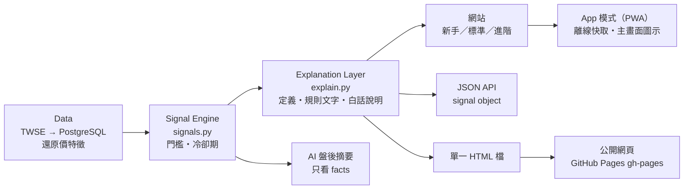
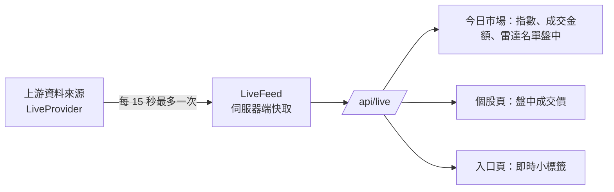

# 架構：Data → Signal Engine → Explanation Layer → UI／AI

每一層只依賴上一層的輸出。UI 和 AI 不自己算數字，也不自己寫名詞定義；要改門檻或說法，只改一個地方。



| 層 | 檔案 | 負責 | 不做 |
| --- | --- | --- | --- |
| Data | `adapters/`、`normalizers/`、`repository.py`、`features.py`、`audit.py` | 抓官方資料、驗證、入庫、還原價、稽核 | 不判斷異常 |
| Signal Engine | `signals.py` | 門檻、冷卻期、`evidence`（判斷依據的數字）、版本號 | 不產生文字 |
| Explanation Layer | `explain.py`、`formatting.py` | 每種訊號的分類、方向、「是什麼／代表什麼／不代表什麼」、由常數產生的規則文字、市場狀況、個股「為什麼被雷達注意」與「簡單理解」 | 不查資料庫、不給建議 |
| UI | `web/app.py`、`web/templates/`、`web/static/` | 版面、資訊層級、模式、說明彈窗、K 線時間範圍、App 外殼 | 不寫死門檻或定義 |
| AI | `summary.py` | 用 facts 寫摘要，寫入前檢查每個數字與用語 | 看不到 facts 以外的資料 |

## Signal object

`/api/signals` 與網站共用同一個結構（`explain.signal_object`）：

```json
{
  "type": "vol_spike", "label": "量能爆增", "category": "volume", "category_label": "成交量", "tone": "neutral",
  "symbol": "6225", "name": "天瀚", "industry": "光電業", "date": "2026-09-24",
  "value": 20.5877, "threshold": 4.0,
  "evidence": { "close": 50.4, "ret_1d": 0.090909, "volume": 2846605, "turnover": 124867383, "vol_avg20": 138267.0 },
  "explanation": "今天成交量約為過去 20 個交易日平均的 20.6 倍，成交金額 1.2 億元。",
  "evidence_text": "量比 20.6 倍・成交 1.2 億"
}
```

（`/api/signals?type=vol_spike` 2026-09-24 的實際回應。）`/api/signal-types` 列出所有訊號的定義與規則；`/api/stocks/{symbol}/explain` 回傳個股的「為什麼被雷達注意」。

## 閱讀流程與資訊層級

目標：10 秒知道今天市場怎麼樣、30 秒知道有哪些異常、1 分鐘知道某檔股票為什麼出現在雷達、3 分鐘可以繼續查 K 線、法人、歷史訊號、同產業。

| 頁面 | 順序 | 來源（都是固定規則，不用 AI） |
| --- | --- | --- |
| 今日市場 | 市場狀態與指數（Level 1）→ 漲跌家數、成交金額、櫃買指數（Level 2）→ 今日一句話 → 今日 3 大重點 → 雷達總覽 → 類股輪動 → 詳細市場資料（Level 3，可展開；進階模式有資料品質與更新時間） | `market_state`、`key_points` |
| 今日雷達 | 分類統計 → 今日異常摘要（訊號數 → 量比 → 今日漲跌幅排序）→ 分類頁籤 → 每一類：歷史訊號表現、判斷條件（進階）、桌面表格／手機卡片 | `anomaly_digest`、`signal_metrics`、`past_performance` |
| 個股 | 基本資訊與今日為什麼被注意 → 為什麼被雷達抓到 → 數據狀態 → 接下來可以查看 → 價格走勢（1M／3M／6M／1Y，資料不夠長的不顯示）→ 法人 → 歷史訊號 → 同產業 → 其他 | `signal_chip`、`stock_story` |
| 搜尋 | 代號或名稱；條件搜尋（量比 ≥ 3 倍、今日漲幅 ≥ 5%、創 60 日新高、外資連買 5 日以上） | `queries.SCREENS` |

頁籤與 K 線範圍都是單選按鈕＋CSS，不需要程式，所以 iPhone 的檔案預覽與公開網頁（匯出檔）也能切換。
「歷史訊號表現」用中位數，和同一天全部股票比；筆數少於 30 就只寫「歷史樣本不足」。顏色只用在漲跌幅（紅漲綠跌），資訊用藍色。

## App 模式（PWA）

- `/manifest.webmanifest`：名稱、圖示（192／512，含 maskable）、`display: standalone`、捷徑（今日雷達、搜尋股票）。
- `/sw.js`（根目錄，範圍涵蓋整站）：頁面先連伺服器、失敗才用上次存下的版本（最多 80 頁），再不行顯示 `/offline`；
  樣式與圖示先用快取，網址帶 CSS 內容雜湊，改版後舊快取自動刪除。API 不快取。
- 多頁式：今日市場（`/`）、今日雷達（`/radar`）、搜尋（`/search`）、個股（`/stock/{代號}`）、資料與計算方式（`/about`）各是一頁；看過去的日子時，在市場與雷達之間切換會帶著 `?date=`。
- 單一 HTML 檔用同樣的頁面：`#v-market`、`#v-radar`、`#v-search`、`#s-{代號}`、`#v-about`，一次只顯示一頁。
  換頁只靠網址的 # 與 CSS `:target`／`:has()`（網址指到某一頁或頁裡的段落就顯示那一頁，沒有 # 時顯示今日市場），新手／標準是頁首的單選按鈕，CSS 直接看勾選狀態；所以 iPhone／iPad 從 LINE、「檔案」預覽時（不執行 JavaScript）也能換頁、返回、切換模式。
  能執行 JavaScript 時另外補上：離線搜尋、記住模式、分頁標題、返回時還原捲動位置。不能執行時搜尋頁會說明原因，改列檔案收錄的個股頁。
- 導覽項目只定義一次（`base.html` 的 `navitems`）：桌面放在上方導覽列，手機（≤ 620px）放在底部分頁列，測試確保兩邊一致。
- 搜尋頁記錄「最近看過」（只存在該裝置的 localStorage，可清除）。
- 安裝條件：瀏覽器只在 HTTPS 或 `localhost` 允許安裝與離線快取。單一 HTML 檔可以在手機上用，但不能「安裝」。

## 上市與上櫃

| 市場 | 來源 | 歷史 | 交易日曆 |
| --- | --- | --- | --- |
| 上市 TWSE | 證交所盤後報表（`adapters/twse.py`） | 可查任意日期，回補了一年 | 由它決定（查無資料的日子記成休市） |
| 上櫃 TPEX | 櫃買中心 OpenAPI（`adapters/tpex.py`） | 只有最新一天，2026-10-02 起每天收集 | 不決定：有資料就補成交易日，沒資料不會記成休市 |

- 兩邊輸出同一套資料模型（`market` 欄位區分），入庫、還原價、特徵、訊號、回測、網站都共用；筆數檢查以各自市場的前一天比較。
- 櫃買中心網站的歷史查詢目前對程式沒有回應；之後若能用，再一次補齊上櫃的歷史。不繞過任何人機驗證。
- 上櫃的訊號需要歷史（量比 20 日、新高新低 60 日），會在累積足夠天數後陸續出現。

## 盤中即時（radar/live.py）



- **資料來源可替換**：`LiveProvider`（`key`、`name`、`usage`、`public_ok`、`fetch(symbols)`）。目前只有 `MisProvider`
  （證交所基本市況報導，`public_ok=False`，只給自己看）。上架前換成有授權的來源：新增類別、登記在 `PROVIDERS`、改 `LIVE_PROVIDER`。
- **快取與上游請求數**：`LiveFeed` 以「股票組合」為鍵快取（開盤 15 秒、其他 10 分鐘），同一時間只有一個上游請求；
  使用者再多，上游請求數也不變。上游失敗時回上一次的資料並標示 `stale`。
- **只在有新資訊時出現**：頁面帶著它的盤後日期（`data-day`），即時報價的日期比它新才顯示；晚上盤後資料進來後自動收起。
- **人多時的下一步**：目前是每 15 秒輪詢（經過快取，很便宜）；使用者很多時可改成 Server-Sent Events 由伺服器推送，`LiveFeed` 不用改。

## 公開網頁（radar/jobs/pages.py）

公開的版本就是「單一 HTML 檔」：沒有伺服器、沒有資料庫連線、沒有盤中即時行情，所以不會暴露本機的任何東西。

- 每日流程匯出完，如果 `.env` 有 `PAGES_REPO`，就把最新交易日的檔案當成 `index.html`（加 `.nojekyll`），
  在 `data/pages` 建一個只有一個 commit 的 `gh-pages` 分支並強制推送。網址固定，內容每天換。
- 用 sha256 記住上次發布的內容（`data/pages.published`），一樣就不推；匯出檔不存在或小於 100 KB 就不發布。
- 失敗只記 log（`_safe`），不影響行情與其他步驟；前一天的網頁維持原樣。
- 要換成別的靜態主機（Cloudflare Pages、Netlify 等），只要換掉推送的那一步，匯出檔不用改。

## 之後的階段（只保留結構，目前不做）

首頁不為了「未來性」塞入這些功能；下表是現有結構可以怎麼接。

| 階段 | 內容 | 已有的基礎 | 還缺 |
| --- | --- | --- | --- |
| Phase 2 個人化雷達 | 收藏、搜尋、通知 | 搜尋與 `/api/search`；「最近看過」；signal object 有 `symbol`／`type`／`category` 可直接篩選；App 模式的 service worker 是推播通知的前提 | 收藏清單（先存 localStorage，要跨裝置再加帳號與資料表）；Web Push 需要 HTTPS 與推播金鑰 |
| Phase 3 歷史統計與回測 | 歷史訊號統計、回測、訊號有效性 | **已完成**：`radar/outcomes.py` 每天重算 `signal_outcomes`（每筆訊號之後 5／20／60 日與隔天才買的 20 日報酬）與 `market_forward_returns`（同一天全部股票的基準）；網站 `/backtest`、`/api/backtest`；快照用 `as_of` 只取當時已知的結果 | 更長的歷史（目前約一年、同一種盤勢）；分盤勢（多頭／空頭）比較 |
| Phase 4 基本面與事件 | 財報、新聞、法說會、重大事件 | `stocks`／`industries` 以 `stock_id` 串接；`corporate_actions` 已示範「官方資料表 → 還原 → 稽核」的流程；`stock_story` 的 facts 是清單，可以加新的事實 | 各資料源的 adapter、資料表與使用規範確認 |
| Phase 5 AI | AI 解釋、自然語言搜尋、AI Market Summary | 盤後摘要已完成（只看 facts、數字檢查、拒答處理）；`/api/stocks/{symbol}/explain` 是結構化的事實來源；`ai_queries` 資料表已建好（問題、工具呼叫、模型、token、延遲） | 問答介面與工具定義；同樣的數字檢查與不給建議的規則 |
